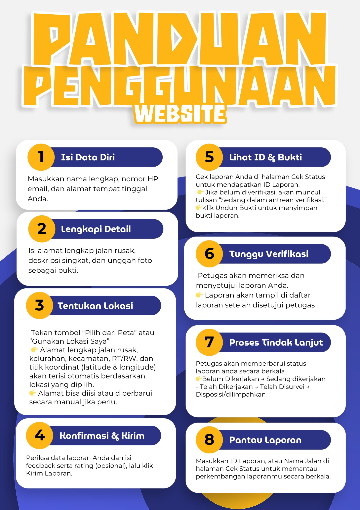

<div align="center">
  <a href="https://samarindakota.go.id/" target="_blank">
    
  </a>
  &nbsp;&nbsp;&nbsp;&nbsp;
  <h1>Jalan Peduli - Pelaporan Kerusakan Jalan Samarinda</h1>
  &nbsp;&nbsp;&nbsp;&nbsp;
  <a href="https://dpupr.samarindakota.go.id/" target="_blank">
    
  </a>
</div>

<p align="center">
  Platform web untuk melaporkan dan memantau kerusakan infrastruktur jalan di Kota Samarinda, dikembangkan untuk Dinas Pekerjaan Umum dan Penataan Ruang (PUPR) Kota Samarinda.
</p>

<p align="center">
  <a href="https://github.com/laravel/framework/actions"></a>
  <a href="https://packagist.org/packages/laravel/framework"></a>
  <a href="https://packagist.org/packages/laravel/framework"></a>
  <a href="https://packagist.org/packages/laravel/framework"></a>
</p>

---

## 📋 Tentang Proyek

**Jalan Peduli** adalah sebuah inisiatif digital yang menjembatani masyarakat Kota Samarinda dengan Dinas PUPR. Aplikasi ini mempermudah warga untuk melaporkan kerusakan jalan secara cepat dan efisien, serta memungkinkan dinas terkait untuk mengelola, memverifikasi, dan menindaklanjuti laporan dengan lebih terstruktur.

<br>

<p align="center">
  
</p>

---

## ✨ Fitur Utama

* 📱 **Pelaporan Mudah:** Laporkan kerusakan jalan lengkap dengan detail lokasi (via peta atau geolokasi), deskripsi, dan unggah foto sebagai bukti.
* 🔍 **Cek Status Laporan:** Pantau progres perbaikan laporan Anda secara transparan hanya dengan menggunakan ID Laporan atau nomor telepon.
* 🗺️ **Peta Interaktif:** Lihat sebaran semua laporan kerusakan jalan yang telah diverifikasi oleh petugas di seluruh wilayah Samarinda.
* 📊 **Dasbor Statistik:** Akses data dan statistik laporan berdasarkan status (diterima, diproses, selesai), jenis, dan tingkat kerusakan.
* ❓ **FAQ:** Temukan jawaban atas pertanyaan yang sering diajukan mengenai proses pelaporan dan perbaikan.
* 🔒 **Panel Admin:** Sistem login terpisah bagi petugas PUPR untuk melakukan manajemen, validasi, dan pembaruan status laporan.

---

## 🛠️ Tech Stack

| Kategori            | Teknologi                                                                                                                                                                                                                                                                                            |
| ------------------- | ---------------------------------------------------------------------------------------------------------------------------------------------------------------------------------------------------------------------------------------------------------------------------------------------------- |
| **Backend** |                                                                                                                                                                                   |
| **Frontend** |                                      |
| **Database** |                                                                                                                                                                                       |
| **Library & Tools** |     |
| **Layanan Eksternal** |    |                                                           |

---

## 🚀 Instalasi & Konfigurasi

### Kebutuhan Sistem
* PHP >= 8.1
* Composer
* Node.js & NPM
* Database Server (cth: MySQL, MariaDB)

### 1. Penyiapan Lokal (Development)

1.  **Clone Repositori**
    ```bash
    git clone <URL_REPOSITORI_ANDA>
    cd <NAMA_FOLDER_PROJECT>
    ```

2.  **Instal Dependensi**
    ```bash
    composer install
    npm install
    ```

3.  **Konfigurasi Environment**
    Salin file `.env.example` menjadi `.env` dan sesuaikan nilainya.
    ```bash
    cp .env.example .env
    ```
    Pastikan Anda mengisi konfigurasi database (`DB_*`), URL aplikasi (`APP_URL`), dan kunci API layanan eksternal (opsional).

4.  **Setup Aplikasi**
    ```bash
    php artisan key:generate
    php artisan migrate --seed # Jalankan seeder jika ada
    php artisan storage:link
    ```

5.  **Jalankan Server Pengembangan**
    ```bash
    npm run dev    # Di satu terminal
    php artisan serve  # Di terminal lain
    ```
    Aplikasi dapat diakses di `http://127.0.0.1:8000`.

### 2. Replikasi di Produksi (Production)

1.  Clone repositori di server Anda.
2.  Instal dependensi untuk produksi: `composer install --no-dev --optimize-autoloader`.
3.  Konfigurasi file `.env` untuk lingkungan produksi (`APP_ENV=production`, `APP_DEBUG=false`).
4.  Jalankan `php artisan key:generate`.
5.  Jalankan migrasi: `php artisan migrate --force`.
6.  Build aset frontend: `npm install && npm run build`.
7.  Buat symlink: `php artisan storage:link`.
8.  Pastikan izin folder `storage` dan `bootstrap/cache` sudah benar (writable oleh web server).
9.  Arahkan web server (Nginx/Apache) ke direktori `public`.
10. Optimalkan konfigurasi dan route: `php artisan optimize`.

---


## External API (Coba Langsung di Postman)

Proyek ini menyediakan API eksternal untuk pelaporan kerusakan jalan. Semua endpoint API dilindungi oleh API Key.

### 🔑 Cara Mendapatkan API Key
1. Login sebagai Super Admin di aplikasi web.
2. Buka: `http://domain.com/superadmin/api-keys`
3. Klik "Generate API Key Baru", lalu salin API Key yang muncul.

---

### 🚦 Contoh Penggunaan Endpoint di Postman

#### Endpoint: Membuat Laporan Baru

- **URL:** `http://localhost:8000/api/laporan`
- **Method:** `POST`
- **Headers:**
  - `X-API-KEY: [API_KEY_YANG_ANDA_DAPATKAN]`
  - `Accept: application/json`
- **Body:** (pilih `form-data` di Postman)
  - `nama_pelapor` (String)
  - `nomor_telepon` (String)
  - `email_pelapor` (String)
  - `alamat_pelapor` (String)
  - `jenis_kerusakan` (String)
  - `deskripsi_kerusakan` (String)
  - `alamat_lengkap_kerusakan` (String)
  - `kecamatan_id` (Integer)
  - `kelurahan_id` (Integer)
  - `latitude` (Numeric)
  - `longitude` (Numeric)
  - `foto_kerusakan` (File, multiple, type: image)
  - `rating_kepuasan` (Integer, 1-5)
  - `feedback` (String, opsional)
  - `dokumen_pendukung` (File, opsional, type: PDF)

#### Langkah di Postman
1. Pilih method `POST` dan masukkan URL endpoint.
2. Pada tab `Headers`, tambahkan:
   - Key: `X-API-KEY`, Value: `[API_KEY_YANG_ANDA_DAPATKAN]`
   - Key: `Accept`, Value: `application/json`
3. Pada tab `Body`, pilih `form-data` dan masukkan semua field sesuai tabel di atas.
4. Untuk `foto_kerusakan`, pilih type `File` dan tambahkan beberapa file gambar.
5. Klik `Send`.

#### Contoh Response Sukses

```json
{
  "success": true,
  "message": "Laporan Anda berhasil dikirim dan sedang menunggu verifikasi.",
  "data": {
    "id_laporan": "2501010001",
    "status": "Menunggu Verifikasi",
    "detail_url": "http://localhost:8000/api/laporan/2501010001"
  }
}
```

#### Contoh Response Error

```json
{
  "success": false,
  "message": "Data yang diberikan tidak valid.",
  "errors": {
    "email_pelapor": ["The email pelapor field must be a valid email address."]
  }
}
```

---

**Tips:**
- Pastikan semua field wajib diisi.
- Untuk upload file, gunakan type `File` di Postman.
- Jika error 401, cek kembali API Key Anda.

---

##  Usage

* **Masyarakat Umum:** Kunjungi URL publik aplikasi untuk mulai melaporkan kerusakan, melacak status laporan, atau melihat peta sebaran.
* **Petugas PUPR:** Akses rute `/login` untuk masuk ke panel admin menggunakan kredensial yang telah disediakan.

---

## 🤝 Kontribusi

Kontribusi Anda sangat kami harapkan! Jika Anda ingin membantu mengembangkan proyek ini, silakan fork repositori, buat branch baru untuk fitur Anda (`git checkout -b feature/NamaFitur`), dan kirim *Pull Request*.

## 📜 Lisensi

Proyek ini dirilis di bawah Lisensi MIT. Lihat file `LICENSE` untuk detail lebih lanjut.
